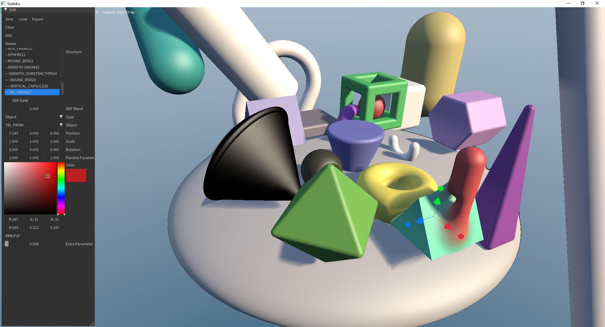

# This is a Rework
This is now a remake from [Mr Hoopers Project](https://github.com/danielchasehooper/ShapeUp-public)
It has more shapes now. You can build up a scene in a tree like structure and manipulate on the fly.

# Known Issues 
- Selecting has some bugs
- saving, loading, exporting does not work at the moment
- canceling a operation with ESC makes program crash

# What is this?
Its a simple 3D Modeller which is internally working with signed distance functions. Mr. Hooper made an article about his project (see below)


# Dependencies
- raylib
- raygui

# Build With CMake
```
cmake -B build -S . -G Ninja -DCMAKE_C_COMPILER=clang -DCMAKE_CXX_COMPILER=clang++
cmake --build build/
```
