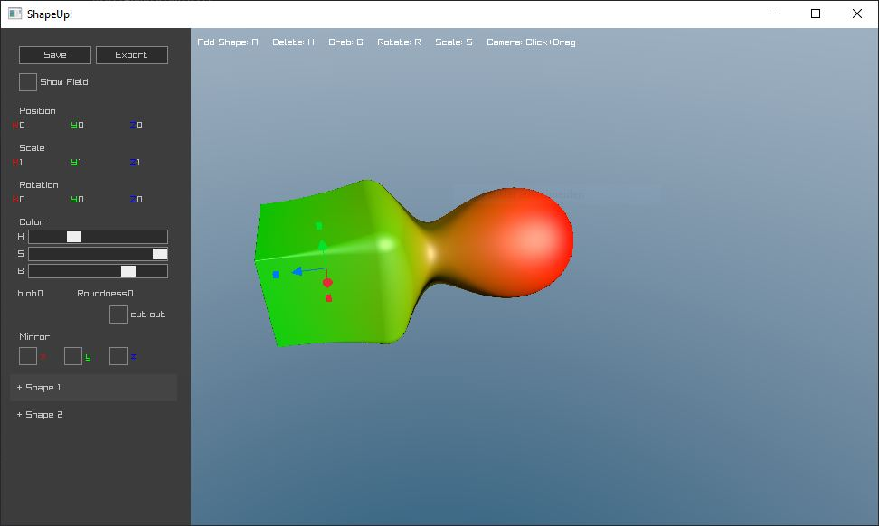
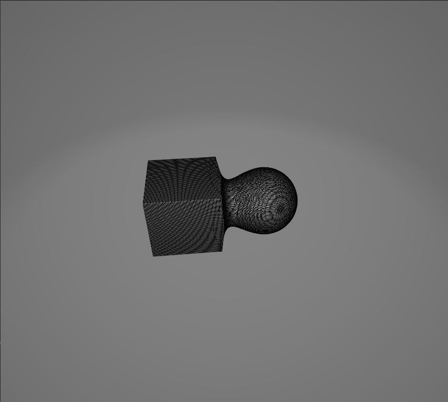

# This is a Fork
This is a fork from [Mr Hoopers Project](https://github.com/danielchasehooper/ShapeUp-public)
I just ported it to windows and transformed it to a cmake project. So further development will be easier. I plan to extend this project.

# What is this?
Its a simple 3D Modeller which is internally working with signed distance functions. Mr. Hooper made an article about his project (see below)

 

# Dependencies
- raylib
- raygui

# Build With CMake
```
cmake -B build -S . -G Ninja -DCMAKE_C_COMPILER=clang -DCMAKE_CXX_COMPILER=clang++
cmake --build build/
```

Original README:
==================
# ShapeUp

A 3D Modeling tool using constructive solid geometry. More information about the project [on my website](https://danielchasehooper.com/posts/shapeup/)

This was written for the 2023 [Wheel reinvention Jam](https://handmade.network/jam/2023). As such, the project is not maintained. This repo exists just because a few people said they were interested in looking at the code for educational purposes. If you have an issue building, I'll take a PR for that, otherwise I'm not accepting bug reports or new features.

This repo is a santitized copy of the original with commit history removed. I was never planning on doing a public release of this code, and I don't feel like auditing/changing the original repo's commit history for code/comments that shouldn't be public.  

# Building

for macOS run `make`  
for web: run `./webbuild.sh`  
for windows: PRs welcome  
